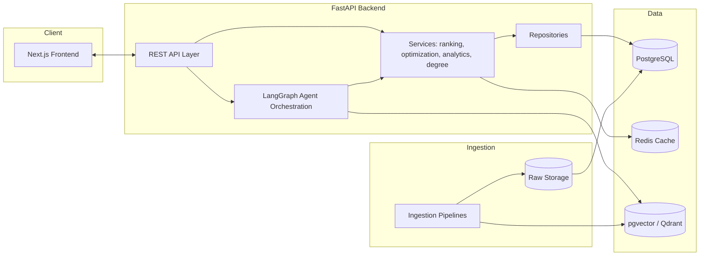
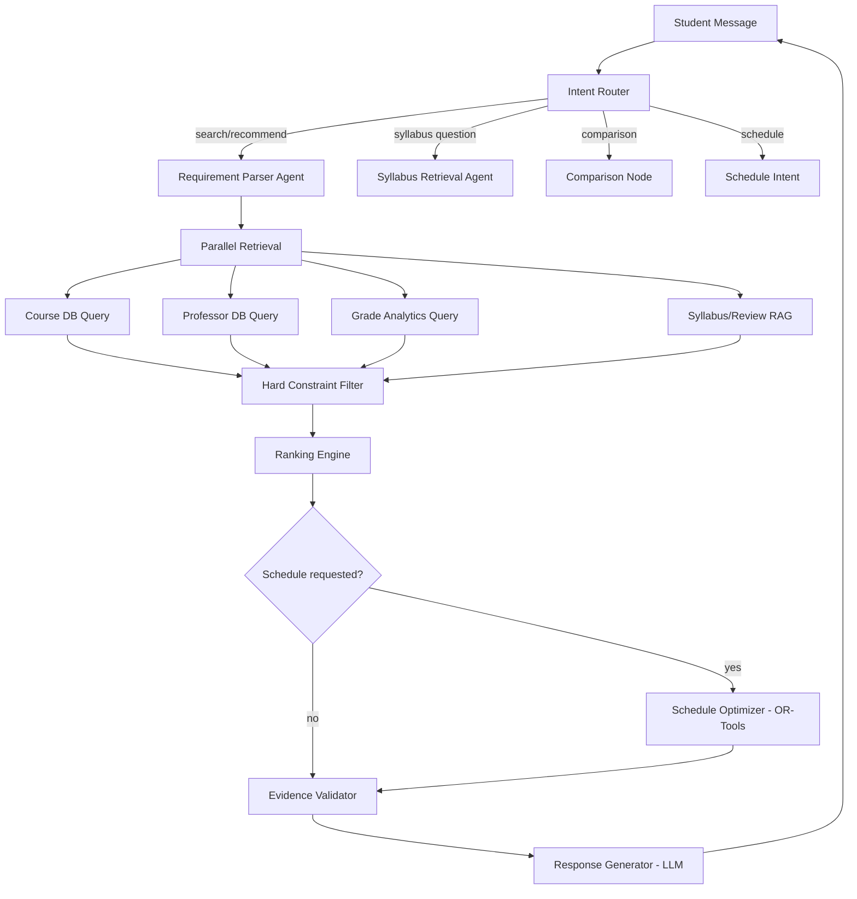
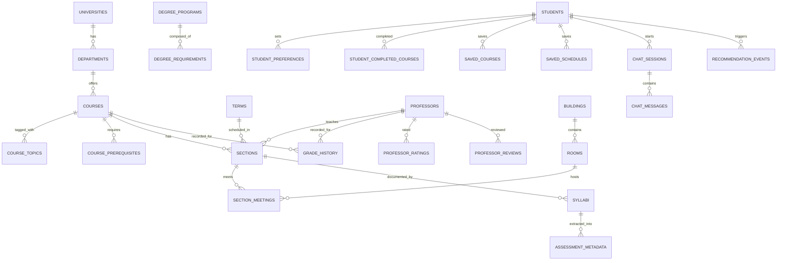

# CampusWise AI — Architecture Proposal

Status: **Draft for approval — no implementation code written yet.**

---

## A. Product Requirements Document

### Problem
Students juggle disconnected tools (catalog, RateMyProfessor-style sites, grade-distribution spreadsheets, PDF syllabi, degree audits) to answer one question: *"What should I take next semester, from whom, and when?"* No single tool combines natural-language intent, verified structured data, and constraint-based schedule generation.

### Users
- **Primary:** Undergraduate/graduate students planning a semester.
- **Secondary:** Academic advisors (read-only visibility, future scope).
- **Admin:** Data stewards who import/curate course, professor, grade, and syllabus data.

### User Stories (representative)
1. As a student, I can type a natural-language request and get ranked course/section/professor matches with explanations.
2. As a student, I can refine my search conversationally ("only online now") without restating prior constraints.
3. As a student, I can compare two professors for a specific course with a transparent table + personalized reasoning.
4. As a student, I can see historical grade distributions with sample-size and term coverage, never a guarantee.
5. As a student, I can ask syllabus-specific questions ("is the final online?") and get a cited, term-stamped answer or an explicit "unknown."
6. As a student, I can save preferences and have them persist across sessions, editable conversationally.
7. As a student, I can generate multiple optimized semester schedules under hard constraints (credits, time windows, no-conflict) and soft objectives (grades, rating, delivery mode).
8. As a student, I can see my degree progress and get next-semester suggestions that respect prerequisites.
9. As an admin, I can ingest new-term data (sections, grades, syllabi) without touching application code.
10. As any user, every factual claim I'm shown carries a provenance badge (OFFICIAL / HISTORICAL / SYLLABUS / STUDENT-REPORTED / AI-SUMMARY) and, where derived, a confidence level.

### Functional Requirements
- NL search → structured hard/soft constraint extraction (RequirementParserAgent).
- Course/professor keyword + semantic search.
- Professor profiles, comparison, historical grade analytics.
- Syllabus RAG with citations and confidence.
- Review summarization (theme extraction, never single-review generalization).
- Personalized, transparent Fit Score with adjustable weights.
- Schedule builder via constraint optimization (OR-Tools CP-SAT), multiple named strategies.
- Conflict detection with alternative-section suggestions.
- Degree planner: prerequisites (deterministic graph logic), progress tracking, next-semester suggestion.
- Multi-university data model from day one (no UTD-specific hardcoding in schema/business logic).

### Non-Functional Requirements
- Hallucination guardrails: LLM never invents ratings/grades/times/seats/prereqs — all such claims resolve through a retrieval/evidence-validation layer.
- Performance targets per §61 of the brief (search <500ms, parsing <2s, ranking <3s, RAG <5s, schedule gen <3s).
- Security: authn/authz, rate limiting, input validation, prompt-injection containment for retrieved documents, secrets in `.env` only.
- Observability: structured logs, latency breakdown per stage, optional LangSmith tracing.
- Data provenance & freshness tracked on every fact-bearing record.
- Responsive UI, desktop-first for schedule builder.

### MVP Scope (Phases 1–5 + minimal RAG, per brief §55)
Course search, professor search, historical grades, ratings, sections, NL search, preference extraction, personalized ranking, professor comparison, basic syllabus RAG, basic schedule builder, conflict detection.

### Explicitly Deferred (post-core, §63)
SSO, registration integration, waitlist/seat alerts, calendar export/integration, mobile app, push notifications, study-group matching, demand/seat prediction, collaborative-filtering ML, career-alignment recommendations, graduation-risk forecasting.

---

## B. System Architecture



**Key principle (per brief §2/§21):** the LLM is confined to two jobs — (1) turning NL into structured constraints, and (2) turning verified retrieved facts into explanations. Everything else (filtering, ranking, optimization, prerequisite logic, grade math) is deterministic code.

---

## C. AI Architecture

### LangGraph workflow



Nodes are a mix of LLM calls (Intent Router, Requirement Parser, Response Generator) and deterministic functions (retrieval, filtering, ranking, optimization, evidence validation). No agent is added without a distinct responsibility — this is the full agent set from brief §21, not more.

### RAG pipeline (syllabi, reviews, policies)
Documents → parse (PDF/HTML) → clean → metadata extraction (university, dept, course, professor, term, section, doc type) → chunk → embed → vector store (pgvector for MVP; Qdrant swap-in later) → hybrid retrieval (dense + BM25) → Reciprocal Rank Fusion → cross-encoder rerank → top-k to LLM → citation-attached response.

### Guardrails
- **Evidence Validator node**: every factual sentence the Response Generator is allowed to assert must trace to a retrieved record (DB row or RAG chunk) attached in that turn's context. Unretrieved facts → forced "not available" phrasing.
- **Provenance object** attached to every fact (`value`, `source_type`, `source_term`, `source_document`, `confidence`) — enforced at the schema level (Pydantic), not just prompt instruction.
- **Prompt-injection containment**: retrieved syllabus/review text is wrapped and labeled as inert data in the prompt; system prompt explicitly forbids treating document content as instructions; no tool-execution permissions are exposed to content inside retrieved chunks.

### Ranking / Fit Score
Deterministic weighted scoring service (not LLM): schedule fit, professor rating, historical grades, delivery mode, exam preference, difficulty, review sentiment, workload — weights adapt from explicit student preferences (default weights documented, not hardcoded as final). Score breakdown + matched/unmatched/missing lists are computed in code; the LLM only phrases the explanation from that structured breakdown.

### Schedule Optimization
Google OR-Tools CP-SAT. Hard constraints as boolean/interval constraints (no overlap, credit range, prerequisites satisfied, seat availability, required courses included, user blackout times). Soft objectives as weighted terms in the objective function, run multiple times with different weight profiles to produce named strategies (Best Overall, Best Professors, Fewest Campus Days, Best Grades, Online-Heavy).

---

## D. Database Design (PostgreSQL, core entities)

Normalized schema per brief §22. Highlights of relationships:



All tables carry `created_at`, `updated_at`; fact-bearing tables (grade_history, assessment_metadata, professor_ratings) additionally carry `source_type`, `source_term`, `source_document`, `confidence`, `last_verified_at`. Every table scoped to `university_id` (directly or transitively) so multi-university support requires no schema change later. Managed via Alembic migrations from the first commit.

---

## E. API Architecture (REST, FastAPI + Pydantic, OpenAPI auto-generated)

Grouped by resource, matching brief §41:
- `GET /courses`, `/courses/{id}`, `/courses/search`
- `GET /professors`, `/professors/{id}`, `/professors/{id}/grades`, `/professors/{id}/reviews`
- `POST /professors/compare`
- `GET /sections`
- `POST /ai/search`, `POST /ai/chat` (session-aware, holds conversational constraint state)
- `POST /recommendations/courses`, `POST /recommendations/professors`
- `POST /schedule/generate`, `POST /schedule/validate`
- `GET /degrees/{id}`, `POST /degree/progress`
- `POST /rag/query`
- Auth: `POST /auth/register`, `/auth/login`, session/JWT refresh endpoints.

All request/response bodies are Pydantic models; errors return structured `{error_code, user_message, debug_detail}` rather than raw tracebacks (brief §62).

---

## F. Frontend Architecture (Next.js 14+, TypeScript, Tailwind)

**Pages:** Landing, AI Advisor (primary chat/search surface), Course Search, Course Details, Professor Search, Professor Profile, Compare Professors, Schedule Builder, Degree Planner, Saved Courses, Saved Schedules, Preferences, Dashboard.

**State:** Server state via React Query (API caching, matches Redis-backed endpoints); light client state (chat session, in-progress schedule draft) via Zustand or React context — no heavier state library needed at this scale.

**Component families:** `CourseResultCard`, `ProfessorProfileCard`, `ComparisonTable`, `FitScoreBreakdown`, `WeeklyScheduleCalendar`, `ChatThread`, `EvidenceBadge` (renders provenance: OFFICIAL/HISTORICAL/SYLLABUS/STUDENT-REPORTED/AI-SUMMARY), `GradeDistributionChart`.

UX principle enforced throughout: no AI/infra jargon (embeddings, RRF, LangGraph, reranker) surfaces to the user — only "here's what matched and why" (brief §59).

---

## G. Development Roadmap

Phased exactly per brief §54, each phase ending in: working code, migrations, tests passing, manual test steps documented, before moving on. No phase jumps ahead of its dependencies.

| Phase | Deliverable |
|---|---|
| 1 | Monorepo, FastAPI, Next.js, Postgres, SQLAlchemy/Alembic, Docker Compose, Redis, config, health checks, basic auth |
| 2 | Core university data model + seed/sample dataset + basic search APIs |
| 3 | Course/professor search & profile UI, grade charts, filters |
| 4 | NL search: intent detection, RequirementParserAgent, structured constraints |
| 5 | Recommendation engine: hard filters, feature calc, Fit Score, explanations |
| 6 | Syllabus RAG: ingestion, chunking, embeddings, hybrid retrieval, rerank, citations |
| 7 | Exam/assessment intelligence extraction with provenance |
| 8 | Schedule optimization (OR-Tools), conflict detection, calendar UI |
| 9 | Degree planner: prerequisites graph, progress, next-semester suggestions |
| 10 | Hardening: caching, observability, evaluation harnesses, security, CI/CD |

MVP = Phases 1–5 + minimal slice of 6 and 8 (per brief §55).

---

## H. Repository Structure

```text
campuswise-ai/
├── frontend/
│   ├── app/  components/  hooks/  services/  types/  utils/
├── backend/
│   ├── app/
│   │   ├── api/  agents/  analytics/  core/  database/  evaluation/
│   │   ├── ingestion/  models/  optimization/  ranking/  repositories/
│   │   ├── retrieval/  schemas/  security/  services/  utils/
│   └── tests/
├── data/  raw/  processed/  sample/
├── docs/          <- this file lives here
├── infrastructure/
├── scripts/
├── docker-compose.yml
├── README.md
└── .env.example
```

---

## Open decisions / assumptions going into Phase 1

1. **Vector store:** pgvector for MVP (co-located with Postgres, zero extra infra); Qdrant remains a documented swap-in for Phase 6+ if retrieval scale demands it.
2. **Auth:** NextAuth/Auth.js (email/password + Google) — no university SSO in MVP.
3. **LLM provider:** Claude via Anthropic API for parsing/generation nodes — configurable via `.env`, not hardcoded.
4. **Sample data:** synthetic UTD-flavored dataset (20 courses / 15 professors / 40 sections / multi-term grades / 30+ reviews / syllabi samples / 3 degree programs), clearly labeled as synthetic, never presented as real UTD data.

---

**Awaiting approval to begin Phase 1 (Foundation).** No application code will be written until this is confirmed.
